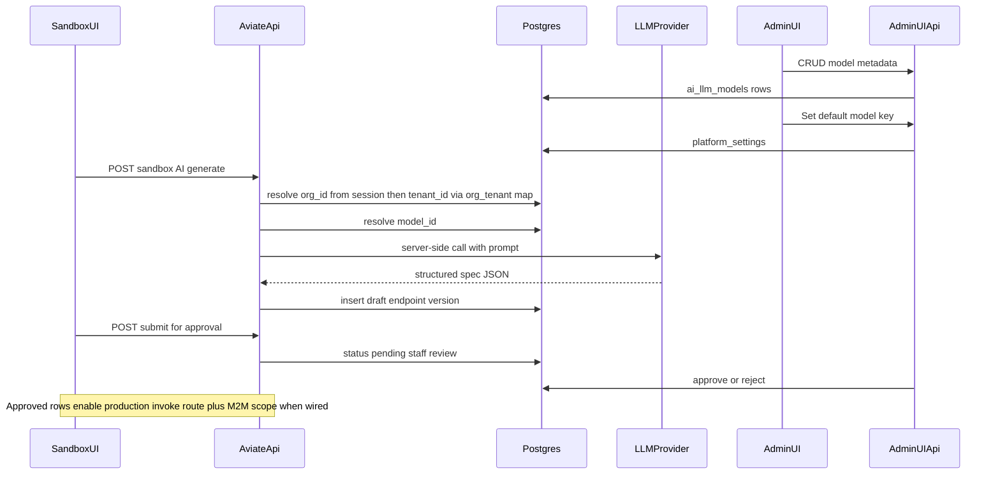

> **Repository archive:** Full product/engineering plan for **sandbox AI → staff approval → production M2M** custom endpoints (**§11.1 GAP-1–12**; **§11.3** = **locked** implementation-defaults reference; **§11.2** = empty ADR backlog until row **13**). The Cursor IDE copy may still live under **`.cursor/plans/ai_sandbox_custom_apis_1e667ce1.plan.md`**; update **this file** in git when you want a new frozen baseline for the team. Related normative docs: [`docs/sandbox-ai-endpoints.md`](../sandbox-ai-endpoints.md), [`packages/database/README.md`](../../packages/database/README.md) (GAP-12 migration order).

# AI-assisted custom API endpoints (sandbox → approval → production)

## Confirmed decisions (from clarifiers)

- **Adopted backlog:** Product and security outcomes for **GAP-1 through GAP-12** are **locked in §11.1** (table + lay terms). **Client `error` catalog, HTTP mapping, and migration checklist** are normative in [`docs/sandbox-ai-endpoints.md`](../sandbox-ai-endpoints.md) and [`packages/database/README.md`](../../packages/database/README.md) — extend those when shipping; avoid restating full GAP text here.
- **Implementation literals (locked):** Former **§11.3** recommendations are **accepted** — see **§4**, **§6.3**, **§6.5**, **§10.2**, **§11.1** (**GAP-1**, **GAP-4**, **GAP-9**), and **§11.3** summary. Mirror URLs, scope name, and JWT claim into **`docs/sandbox-ai-endpoints.md`** when routes ship.
- **Runtime (your choice A — recommended):** Spectra **hosts** execution: persist a versioned definition and run it behind our gateway with **`org_id` isolation**. This is the right MVP versus codegen+CI (slow) or “contract only” (limited value). **Guardrail:** v1 uses a **non–arbitrary-code** contract (OpenAPI fragment + JSON Schema + declarative mapping / template responses). **Execution kinds (v1 GA):** **`static_response`** and **`json_transform`** only (**§11.1 GAP-1**). **No `forward_url` / outbound proxy** in v1 GA (re-open under ADR with SSRF controls + staff gating). Defer “LLM emits executable JS” until dedicated sandboxing and security sign-off. Polyglot in-repo services stay as in [`docs/api-polyglot.md`](../api-polyglot.md). **Production invoke** on **aviate-api** / existing HTTP API (**GAP-4**); **approval automation** = separate deployable + **Step Functions** (**GAP-6**), start **pass-through** to lock contracts (**§8**).
- **`org_id` vs `tenant_id` (mutually exclusive identifiers + tracked map):**
  - **`org_id`** — Spectra control-plane org ([`spectra.orgs`](../../packages/database/src/schema/control-plane.ts)), same as today’s sandbox session [`user_developer_context.org_id`](../../packages/database/src/schema/control-plane.ts). Used for **portal auth**, staff RBAC, billing/grouping, and “which developer org owns this work.”
  - **`tenant_id`** — A **different** stable identifier (recommend new UUID PK, e.g. table `spectra.product_tenants` or `spectra.runtime_tenants`) used for **hosted API runtime isolation** (data partition, routing keys, M2M resource scope). **Never reuse the org row’s UUID as `tenant_id`** and **never treat `org_id` as interchangeable with `tenant_id`** in APIs or DB columns — they are separate columns and separate namespaces.
  - **Mapping:** Persist an authoritative **org ↔ tenant** association (e.g. `runtime_tenants` with required `org_id` FK + unique `id` as `tenant_id`, or a dedicated `org_tenant_bindings` table). **GAP-7 (GA):** **at most one** `runtime_tenants` row per **`org_id`** — **`unique(org_id)`** enforced; portal resolves the single `tenant_id` for that org without ambiguity. **GAP-8:** optional **`external_tenant_ref`** on that row — **never** for auth; **staff** rebinds after create. Every **`developer_ai_endpoint`** row should store **`tenant_id`** (required) and resolve **`org_id`** from session then **verify** `(org_id, tenant_id)` via the map before read/write/invoke. Production tokens can carry **`tenant_id`** (or a claim derived from it) while the portal continues to use **`org_id`** from Auth0 bootstrap.
  - **Auth0 `sub`** still maps **`users.auth_subject` → `org_id`** only; linking a session to a **tenant** is always **join through the map** (or explicit `tenant_id` in the request body/query validated against that org).

## Current anchors in the repo

- **Sandbox portal API:** [`apps/services/aviate-api/src/routes/sandbox-portal.ts`](../../apps/services/aviate-api/src/routes/sandbox-portal.ts) — JWT Auth0, `orgId` from session bootstrap; feature flags via [`platform_settings`](../../packages/database/src/schema/control-plane.ts).
- **Admin platform toggles UI:** [`apps/admin-ui/src/app/views/settings/general-settings-page/`](../../apps/admin-ui/src/app/views/settings/general-settings-page/) + [`apps/services/admin-ui-api/src/routes/admin-platform-ui.ts`](../../apps/services/admin-ui-api/src/routes/admin-platform-ui.ts) — pattern for read/patch `platform_settings`.
- **Approval / production gating precedent:** [`production_access_requests`](../../packages/database/src/schema/control-plane.ts) + [`sandbox-portal-par.ts`](../../apps/services/aviate-api/src/routes/sandbox-portal-par.ts) (org-scoped integration check, staff notifications, catalog-backed `status_id`).
- **Sandbox UI routing:** [`apps/sandbox-ui/src/app/app.routes.ts`](../../apps/sandbox-ui/src/app/app.routes.ts) — add a new authenticated page (e.g. `/ai-apis` or `/custom-endpoints`).

## High-level architecture

## 1. Data model (Drizzle + migrations)

Add tables in [`packages/database/src/schema/control-plane.ts`](../../packages/database/src/schema/control-plane.ts) (with full audit columns per [`.cursor/rules/database-audit-columns.mdc`](../../.cursor/rules/database-audit-columns.mdc)):

- **`ai_llm_models`** — Staff-defined catalog: `id`, `display_name`, `provider` (enum or text), `api_base_url`, `model_name`, `max_tokens`, `json_schema` / prompt hints, **`status_id`**. **Do not** store raw API keys in plaintext JSONB; store either a **reference** to an AWS Secrets Manager / SSM parameter name (resolved at runtime in Lambda) or an encrypted blob with a dedicated KMS key (infra via Terraform per your rule: only change [`terraform/`](../../terraform/) for new parameters, not ad-hoc clicks).
- **`runtime_tenants`** (**locked** table name for GA) — `id` (**this is `tenant_id`**), **`org_id` FK** (owner org), **`unique(org_id)` enforced (GAP-7 locked)** — **exactly one** runtime tenant per developer org for GA; **multiple rows per `org_id`** only after **ADR** + schema migration if a customer truly needs isolation under one org without new Spectra orgs. Optional **`default_pricing_profile_id` FK** → `pricing_profiles.id` (tenant-level default in the **§10.2** resolution chain; nullable until staff/org assigns a profile), optional **`custom_endpoint_trust_tier`** (catalog-backed `status_id` or small enum — **GAP-6**; staff-set; drives §6.4 routing **after** baseline), optional `display_name` / **`external_tenant_ref`** (**GAP-8:** optional **customer label**; **validated** length/charset; **`unique(org_id, external_tenant_ref)` WHERE ref IS NOT NULL**; optional **initial** set on **`POST /sandbox/runtime-tenants`**; **updates / rebind staff-only** with audit — **never** treat ref as auth), audit columns.
- **`developer_ai_endpoints`** — **`tenant_id` FK** (required; **not** nullable `org_id` alone), optional denormalized **`org_id` FK** for query convenience (must match map) or derive org only via join — **`slug` unique per `tenant_id`** (not per org) so runtime routes are tenant-scoped, `created_by_user_id`, lifecycle `status_id`, optional **`pricing_profile_id` FK** (nullable = inherit per resolution chain in §10), **`approved_production_version_id` FK** → `developer_ai_endpoint_versions.id` (**nullable**; **GAP-2 adopted:** set only when staff approves a specific revision for production; **M2M production invoke loads spec only from this version** until a **new** revision is approved and this pointer is updated). New `developer_ai_endpoint_versions` rows do **not** affect production until approved.
- **`developer_ai_endpoint_versions`** — `endpoint_id`, `revision`, `user_prompt`, `model_id` FK snapshot, **`spec`** jsonb (normative: OpenAPI fragment + JSON Schemas + **`execution_kind`** — **v1 allowlist:** `static_response` \| `json_transform` only per **§11 GAP-1 adopted**; validator rejects other kinds before persist), optional **`spec_sha256`** (or similar) **content hash** at rest for integrity / §6.3 fidelity checks, `llm_raw_response` optional (truncated) for support, audit columns.

**Pricing (all endpoints pricing-capable; see §10):**

- **`pricing_profiles`** — Staff-defined catalog row: `display_name`, **`policy` jsonb** (normative contract: included quotas, overage behavior `block` | `throttle` | `meter`, **rate limits** e.g. sustained RPS + burst, **bulk GET** caps such as max `limit`, max response bytes / row count, optional per-method overrides). Use **`status_id`** for deprecation; align with existing catalog/audit patterns ([`scopes.tier`](../../packages/database/src/schema/control-plane.ts) is a loose analogy only — do not overload `scopes` for hosted-endpoint commercial policy).
- **`org_billing_entitlements`** (or equivalent name) — **post-MVP** when subscriptions/Stripe land: links **`org_id`** (and optionally **`plan_id`**) to **default `pricing_profile_id`**, included **custom endpoint slot** counts, etc. **MVP (locked):** use only **`runtime_tenants.default_pricing_profile_id`** + **`platform_settings.sandbox.ai.default_pricing_profile_id`** (§2) — no separate org billing entitlements table required for GA.
- **`usage_events`** (append-only; exempt or minimal audit per product) — `tenant_id`, `endpoint_id`, `dimension` (`request` | `bulk_rows` | `egress_bytes` | …), `quantity`, `occurred_at`, optional `m2m_client_id` / `integration_id` for invoice attribution. Powers **metering** and dashboards; hot-path enforcement may use Redis/Dynamo counters with Postgres as source of truth async.

**`ai_endpoint_production_requests`** (recommended, **separate from PAR**): keyed to **`endpoint_id`** + **`revision`** (the version under review); catalog-backed `status_id`; on **approve**, backend sets **`developer_ai_endpoints.approved_production_version_id`** to that version’s `id` (and optionally copies **`spec_sha256`** onto the request row for audit); **`staff_visible_rejection_reason`** (or `reason_code` + `reason_text`), **`user_follow_up`** jsonb (developer replies with timestamps per §6.5), **`internal_staff_notes`**; optional non-authoritative **`related_integration_id`** for ops only; **GAP-6:** optional **`stepfunctions_execution_arn`**, **`staff_task_token_ref`** (or encrypted token), **`precheck_summary` jsonb** (baseline signal rollup) — exact columns TBD, persist enough for **§7** audit (“what did automation say?”). **Do not** fold this lifecycle into [`production_access_requests`](../../packages/database/src/schema/control-plane.ts) — PAR stays integration/org production access only.

Indexes: **`(tenant_id, slug)`** unique where not deleted; **`(tenant_id, status_id)`** for lists; index on **`org_id`** for portal list views (join through `runtime_tenants`); **partial unique index** on **`(org_id, external_tenant_ref)` WHERE `external_tenant_ref` IS NOT NULL** (**GAP-8**); index on **`developer_ai_endpoints.approved_production_version_id`** for production routing lookups (nullable column).

**Drizzle / SQL apply order (§11.1 GAP-12):** migrations **must** create **`pricing_profiles`** before **`runtime_tenants`** when **`runtime_tenants.default_pricing_profile_id`** references **`pricing_profiles`**; then tables that FK to **`runtime_tenants`**. See [`packages/database/README.md`](../../packages/database/README.md) and [`docs/sandbox-ai-endpoints.md`](../sandbox-ai-endpoints.md).

## 2. Platform settings

Extend [`platform_settings`](../../packages/database/src/schema/control-plane.ts) with keys (constants in `@spectra/database`, parsers like existing [`PLATFORM_DEVELOPER_APPLICATIONS_UI_KEY`](../../packages/database)):

- `sandbox.ai.endpoints_enabled` (boolean) — gate the whole feature (sandbox + invoke).
- `sandbox.ai.default_llm_model_id` (uuid string) — fallback when org has no override.
- `sandbox.ai.default_pricing_profile_id` (uuid string) — last-resort profile in the **effective policy** resolution chain (§10).
- `sandbox.ai.precheck_enabled` (boolean) — when **true**, run full **§6.3 / GAP-6** baseline pipeline (not only stub); when **false**, engine may **no-op** or run minimal checks (product choice).
- `sandbox.ai.approval_automation_enabled` (boolean) — master switch to **start Step Functions** on submit / enqueue (v1 may still execute **stub** definition until workers exist).
- `sandbox.ai.machine_auto_approve_enabled` (boolean, **default false for GA**) — only when **true**, **GAP-6** may perform **machine** approve transition after baseline green + trust policy; requires audit columns populated.

Optional org-level override: new column on `orgs` or a small `org_ai_settings` table — only if product needs per-tenant model selection without staff changing global default.

## 3. Admin UI + admin-ui-api

- **New staff routes** in [`apps/services/admin-ui-api`](../../apps/services/admin-ui-api): CRUD `ai_llm_models` (list/get/create/update soft-delete), guarded by **`platform:sandbox_ai_models:manage`** (**§11.1 GAP-10**; `requireStaffPermission` pattern as in [`admin-integrations.ts`](../../apps/services/admin-ui-api/src/routes/admin-integrations.ts)).
- **Custom endpoint approval (§6):** list/detail/patch for **`ai_endpoint_production_requests`** — staff set approve / reject / needs-information, **developer-visible reason**, internal notes; **surface §6.3 / GAP-6** outputs (baseline signals, Step Functions **execution** id / link, pass-fail summary) on the detail view; **approve** action completes **human-wait** path — **GA default:** Step Functions **`WaitForTaskToken`** + **`SendTaskSuccess`** from **admin-ui-api** with persisted task token (**§6.3**); guard with **`platform:custom_endpoints:review`** (**GAP-10**).
- **Pricing profiles (§10):** CRUD **`pricing_profiles`** (list/create/edit/clone/deprecate), guarded by **`platform:pricing_profiles:manage`** (**GAP-10**); optional **org / `runtime_tenants` assignment** UI to set default profile and included endpoint counts; **read-only “effective policy”** preview on endpoint approval detail (resolved chain: endpoint → tenant → org → platform default).
- **`runtime_tenants` (GAP-6 / GAP-8):** staff UI + route to set **`custom_endpoint_trust_tier`** (and related fields) with audit — drives §6.4 routing **after** baseline; not inferrable from PAR. **Staff-only PATCH** for **`external_tenant_ref`** rebind (**GAP-8**) with `updated_by` + optional reason — **GA:** same permission as approval-queue surface, **`platform:custom_endpoints:review`** (**GAP-10**); **split** to a dedicated string **only** via **ADR** if compliance requires segregation from approvers.
- **Register routes** in [`apps/services/admin-ui-api/src/routes/admin.ts`](../../apps/services/admin-ui-api/src/routes/admin.ts).
- **Admin Angular:** new area under Settings or Platform (your product preference): model list/editor + “default sandbox AI model” bound to `platform_settings`; **parallel “Pricing profiles”** and **default pricing profile** key. Mirror [`general-settings-page`](../../apps/admin-ui/src/app/views/settings/general-settings-page/general-settings-page.ts) for PATCH semantics and error handling.
- **Secrets UX:** Admin enters API key once → backend writes to **Secrets Manager/SSM** (via AWS SDK in admin-ui-api or a small internal endpoint); DB stores **`secret_ref`** only. Document required IAM on the Lambda role in Terraform.

### 3.1 Admin UI navigation (`menuItems` + routes)

Add **sidenav entries** and **Angular routes** so staff can reach every §3 surface (pattern: **Platform** children in [`apps/admin-ui/src/app/layouts/components/data.ts`](../../apps/admin-ui/src/app/layouts/components/data.ts), same as **Production access**; lazy routes in [`apps/admin-ui/src/app/views/views.route.ts`](../../apps/admin-ui/src/app/views/views.route.ts) or a dedicated `*.route.ts` imported from `views.route.ts`). Use optional **`menuKey`** + [`templateNavVisibilityGuard`](../../apps/admin-ui/src/app/guards/template-nav-visibility.guard.ts) (or equivalent) to **hide** items when the staff user lacks the **§11.1 GAP-10** permission (client-side nav only — **admin-ui-api** remains authoritative).

| Sidenav label (suggested) | Route(s) | Page / generator scope | Min. permission (GAP-10) |
|---------------------------|----------|-------------------------|---------------------------|
| **Custom endpoint approvals** | `/platform/custom-endpoints` (list), `/platform/custom-endpoints/:id` (detail) | Queue + detail for **`ai_endpoint_production_requests`** (approve / reject / needs-info, reasons, §6.3/GAP-6 signals, **`SendTaskSuccess`**) | `platform:custom_endpoints:review` |
| **Pricing profiles** | `/platform/pricing-profiles` (list), `/platform/pricing-profiles/:id` (edit / clone) | CRUD **`pricing_profiles`**; optional default assignment UX for org / `runtime_tenants` | `platform:pricing_profiles:manage` |
| **Sandbox AI models** | `/platform/sandbox-ai-models` (list), `/platform/sandbox-ai-models/:id` (edit) | CRUD **`ai_llm_models`**; **`secret_ref`** UX (§3) | `platform:sandbox_ai_models:manage` |
| **Runtime tenants** | `/platform/runtime-tenants` (list), `/platform/runtime-tenants/:id` (detail) | Staff **`custom_endpoint_trust_tier`**, **`external_tenant_ref`** PATCH (**GAP-6** / **GAP-8**); read-only org / `tenant_id` context | `platform:custom_endpoints:review` (GA; ADR if split) |

**Settings (§2 toggles):** Either extend existing [**Settings → General**](../../apps/admin-ui/src/app/views/settings/general-settings-page/) (`/settings/general`) with **`sandbox.ai.*`** keys from §2, **or** add a child **Sandbox AI** at `/settings/sandbox-ai` — product choice; if a separate page, add one **Settings** child row in `menuItems`.

**Implementation order for scaffolding:** (1) register lazy routes + empty page shells, (2) append **Platform** `children` in `data.ts`, (3) wire `data: { title, templateNavMenuKey? }` on routes for topbar/title, (4) connect to **admin-ui-api** as §3 routes land.

## 4. Sandbox portal (aviate-api)

Under [`createSandboxPortalRouter`](../../apps/services/aviate-api/src/routes/sandbox-portal.ts) (same Auth0 middleware):

- `GET/POST /v1/platform/sandbox/ai-endpoints` — list/create; body may include **`tenant_id`** (must match session **`org_id`** via **`runtime_tenants`** — **GAP-7:** **get-or-create** the **single** row per org; omit `tenant_id` in body if product resolves it implicitly from session org). `userPrompt`, optional `modelId`. **POST `/sandbox/runtime-tenants`** — **idempotent**: returns existing `tenant_id` if **`unique(org_id)`** row already exists, else inserts one (**GAP-7**); optional **`external_tenant_ref`** in body **only on create** when inserting the new row — must pass **GAP-8** validation (**GAP-8:** no self-serve **update** of ref after row exists; use staff rebind).
- `POST .../ai-endpoints/:id/generate` — verify endpoint’s **`tenant_id` → org_id** matches session org, then call LLM, validate structured output, write `developer_ai_endpoint_versions`.
- `POST .../ai-endpoints/:id/submit-approval` — creates/updates **`ai_endpoint_production_requests`**; transitions to pending staff review; **does not require PAR to exist first** (**GAP-3**); when **`sandbox.ai.approval_automation_enabled`** (**§2**), **enqueue** **GAP-6** Step Functions execution (stub or full per flags), persist **execution ARN** / correlation on the request row; optional staff queue notification (reuse patterns from [`sandbox-portal-par.ts`](../../apps/services/aviate-api/src/routes/sandbox-portal-par.ts) / [`par-notification-writer`](../../packages/database/src/lib/par-notification-writer.ts)).
- **Approval status + user follow-up (for `sandbox-ui`):** `GET .../ai-endpoints/:id/approval` (or embed in `GET .../ai-endpoints/:id`) — return staff-visible **rejection / needs-information reason**, timestamps, status; `POST .../ai-endpoints/:id/approval/user-response` — body with developer **supplied info** (and optional pointer to new version) to move request back toward staff queue per §6.5.

**Invocation (preview):** `POST .../invoke` — Auth0 user token only; resolve **`org_id`** from session; verify endpoint’s **`tenant_id`** is mapped to that org; body or query may specify **`revision`** to test a draft (default: latest **non–production-only** draft per product rules); spec validation; **GAP-5:** resolve and enforce **`effective_policy`** with the **same §10.2 resolution chain** and the **same** rate-limit / bulk-cap / quota **enforcement** as production M2M invoke for the same endpoint/tenant (no preview-only relaxed policy or multipliers for GA); optional **abuse** throttles keyed by **`user_id`** on the preview path are **orthogonal** (anti-spam), not a second commercial policy. No M2M.

**OpenAPI merge (`GAP-9`):** **`GET /v1/platform/sandbox/ai-endpoints/openapi`** (**locked** path under [`createSandboxPortalRouter`](../../apps/services/aviate-api/src/routes/sandbox-portal.ts); same Auth0 middleware as other **`/v1/platform/sandbox/...`** routes) — returns a **merged OpenAPI document** for the session **`org_id` / `tenant_id`** only; **may** include **draft**, **pending**, **rejected**, and **needs-information** operations so developers see their **private preview** contract (**never** treat this response as the **public** catalog). **Public** merged OpenAPI (static file, CI-built, or unauthenticated route — product picks one) **must** apply **`GAP-9` filter:** include a custom operation **only** if **`endpoint-approved` + PAR satisfied + `approved_production_version_id` set**; **exclude** all other lifecycle states from **public** output. Use **distinct URLs and cache keys** for public vs org-private specs.

**Invocation (production):** **GAP-4 (locked MVP):** host routes on the **existing public aviate-api HTTP API** (same gateway / Terraform root — no **new** API Gateway product for MVP). **Canonical URL prefix (locked):** **`/v1/platform/tenant-runtime/`** — all production M2M tenant-runtime operations live under this prefix (consistent with **`/v1/platform/sandbox/...`**); document in [`docs/sandbox-ai-endpoints.md`](../sandbox-ai-endpoints.md). **M2M** callers must present **`scopes.name` = `custom_endpoints:invoke`** (**locked** string) registered in [`scopes`](../../packages/database/src/schema/control-plane.ts) with **`requires_approval`** and granted via the **same integration-grant patterns** as today. **Access token must include JWT claim `tenant_id`** (**locked** name — **do not** accept **`tn`** or both long-term). Authorizer resolves **org from the integration**, then **validates `(org_id, tenant_id)`** against `runtime_tenants` before handler execution. **Integration binding:** **default** — grant the invoke scope on the **same M2M integration / client** already used for org production access / PAR (**one client, one rotation story**). A **separate** M2M client for invoke-only is **allowed** only with explicit product sign-off + **ADR** (e.g. blast-radius separation). After **GAP-3** PAR and **GAP-2** pin checks, **deny** with the **§11.1 GAP-11** client error taxonomy (e.g. `production_access_revoked`, `endpoint_not_approved`, `no_production_revision_pinned`, …) per [`docs/sandbox-ai-endpoints.md`](../sandbox-ai-endpoints.md). Emit **`usage_events`**. Wire token validation and route registration per [`docs/plans/m2m-client-credentials-edge-auth.md`](m2m-client-credentials-edge-auth.md) / edge config. **Post-MVP:** dedicated Lambda or API segment — **ADR + Terraform** before splitting; until then scale within aviate-api.

## 5. Sandbox UI

- New route + page: **`tenant_id`** resolved from session **`org_id`** via the **single** `runtime_tenants` row (**GAP-7** — auto-create via **`POST /sandbox/runtime-tenants`** if missing); show read-only **`external_tenant_ref`** when set (**GAP-8**); conversational UI (prompt + model read-only if using platform default), list of saved drafts per tenant, version history, “Submit for production” button, status chip (pending / approved / rejected / **needs-information**).
- **Approval UX (§6.5):** when staff reject or request info, show **developer-visible reason** and a **respond to staff** flow (call `.../approval/user-response` from §4). Show **PAR status vs endpoint approval status** separately so users understand they can be **PAR-approved** while specific endpoints are still **not** production-enabled. When **PAR is revoked or inactive** but an endpoint row is still **approved**, show **“Approved — production access disabled (PAR)”** (or equivalent) so users do not think staff un-approved the endpoint (**GAP-3**). When **GAP-6** automation has run, show **read-only baseline summary** (pass/warn/fail chips) so developers see **why** a request is waiting on staff.
- **Pricing UX (§10):** optional profile picker when creating an endpoint (if dev-facing SKUs exist); always show **read-only effective limits** (rate limit summary, bulk caps) — **GAP-5:** these numbers match what production will enforce for the same endpoint/tenant profile context.
- **OpenAPI (`GAP-9`):** optional **“Download / view merged OpenAPI”** calls the **org-private** sandbox-portal merge (§4) — may include **drafts**; never substitute for **public** catalog output.
- Call aviate-api through existing `apiBaseUrl` ([`environment`](../../apps/sandbox-ui/src/environments/environment.development.ts)).

## 6. Staff approval workflow

**Separation (clarified):** **Production access (PAR)** and **per-endpoint staff approval** are **independent workflows** with **independent statuses** — staff queues and DB rows **do not need** to move in lockstep. A user may be **PAR-approved** while endpoints are still pending; they may submit **endpoint review before PAR exists** (**GAP-3**). Conversely, an endpoint may show **staff-approved** while PAR is missing or revoked.

**PAR as ongoing master gate (GAP-3):** PAR is the **org/integration production-access gatekeeper** (often “one-time” in the sense of a **single PAR workflow**, but **not** a one-time check at runtime). **Current PAR must be satisfied** for **any** custom endpoint to serve **production** M2M traffic. If **PAR is revoked, suspended, or lapses**, **all** custom endpoints under that scope **stop working in production** immediately — **without** rewriting per-endpoint approval rows (those remain historical **“approved”**). Runtime returns a clear error (see **`production_access_revoked`** / `par_inactive` in **§11.1 GAP-11** — [`docs/sandbox-ai-endpoints.md`](../sandbox-ai-endpoints.md)). **Revoking PAR** is an acceptable **global kill switch** for incident response and compliance.

**Production invoke gate (clarified):** Enabling **production** traffic for a custom hosted route requires **both** (1) **PAR currently valid** (or equivalent org/integration production access per existing product rules) **and** (2) staff **endpoint-approved** with a **pinned production revision** (**GAP-2:** `approved_production_version_id` non-null and pointing at an active version row). **Additionally** (**GAP-4**), the caller must satisfy **M2M + invoke OAuth scope + `tenant_id` claim** validated against `runtime_tenants`. Implementation: **GAP-4** authorizer (or equivalent) runs **scope + tenant map** checks (**GAP-7:** **0–1** `runtime_tenants` row per org); then **PAR + pin** and **§10 / GAP-5** limits (same **`effective_policy`** enforcement as preview) before routing to the tenant-runtime handler.

**Recorded (Q&A):** Invoke gate is **both required** (not endpoint-only). **Reject/resubmit threading (locked):** **single `ai_endpoint_production_requests` row** with **status-machine transitions** (aligned with **PAR** resubmission style when simpler than immutable child rows); use **`parent_request_id`** child rows **only** if audit explicitly requires one immutable row per attempt (**ADR**).

Extend the **existing PAR patterns** only as **reference** ([`production_access_requests`](../../packages/database/src/schema/control-plane.ts), [`sandbox-portal-par.ts`](../../apps/services/aviate-api/src/routes/sandbox-portal.ts), staff notifications) — **do not merge** PAR rows into endpoint approval rows except an optional **non-authoritative** cross-link (e.g. `related_integration_id`) for ops reporting.

### 6.1 Sandbox testing (pre-submission)

- Users **invoke and iterate** on custom endpoints **only in the sandbox** (Auth0 user token + preview invoke path in §4) **before** any submission to staff.
- Goal: validate behavior, payloads, and declared contract against real calls in the isolated sandbox environment; surface errors and version history in sandbox-ui so submission is an informed choice.

### 6.2 Endpoint-level approval (distinct from PAR)

- **Admins approve or reject each `developer_ai_endpoint` (or each submitted revision)** — scoped **per endpoint** (and per `tenant_id` / org via joins). This is **not** “approve all endpoints because PAR passed.”
- **Admin UI (`admin-ui`):** queue + detail view: approve, reject, **needs-information**, internal notes, **customer-visible rejection / info request** (structured reason codes + free text where useful), full audit trail.
- **Data shape:** dedicated **`ai_endpoint_production_requests`** (or equivalent) keyed to **`endpoint_id`** + **`version`/`revision`**, catalog-backed `status_id` **parallel in spirit to PAR but separate table / separate state machine family** so lifecycle queries stay simple. **Approve** transition **writes** **`developer_ai_endpoints.approved_production_version_id`** (**GAP-2**).

### 6.3 Automated pre-check + approval automation engine (**GAP-6**)

**Implementation (locked):** **One logical approval automation engine** (primary **dedicated service** or tightly scoped worker family — **v1 may be pass-through** / stub to validate **HTTP contract**, **IAM**, **persistence** on `ai_endpoint_production_requests` or child `…_precheck_runs` row). **Do not** split into multiple approval products early; add a **second** service only with **ADR** (e.g. heavy ML isolation).

**Orchestration (locked):** **AWS Step Functions Standard** drives **durable** automated segments — **retries**, **parallel branches** for independent checks, **small state** (ids, `spec_sha256`, correlation ids — **not** full spec JSON in execution input/output where avoidable).

**Baseline (always-on, locked):** **Every** submission path that can advance toward production runs **non-bypassable** automated signals: **fidelity**, **conformity** (incl. **GAP-1** `execution_kind`), **security / compliance** class checks, **abuse / misuse** heuristics (see bullets below). **Trust tier** (**§6.4**) affects **routing and human gates**, **not** whether baseline runs.

**Human-in-the-loop (locked):** Model **explicit wait states** — especially **newer / low-trust** customers (more staff gates, longer waits). **GA default (locked):** **Step Functions task token** (`WaitForTaskToken`) + **`SendTaskSuccess` / `SendTaskFailure`** from **admin-ui-api** when staff acts — **bounded** review SLAs, **single execution trace**. **Escape hatch:** if reviews routinely idle **weeks+** or ops requires SFN executions to **close** between human phases, switch to **Postgres-authoritative** **`awaiting_staff`** + **new** SFN execution on staff action (**ADR** to change default). Persist **task token** or **execution ARN** securely on the request row when used; define **timeouts / escalation**. **GA:** human (or human-confirmed UI action) still performs the **approve** transition that sets **`approved_production_version_id`** (**GAP-2**). **Machine auto-approve** only with **explicit `platform_settings` / feature flags**, **baseline all green**, and **audit** (`updated_by` system principal + link to automation run id).

Prior to / alongside staff review, run validation on the **frozen** spec + metadata (results stored for staff and sandbox-ui):

- **Fidelity** — spec matches the **pinned** production version (**GAP-2:** compare hash/snapshot to `approved_production_version_id` target, or to the revision under review for pre-approval checks); LLM output still validates against JSON Schema.
- **Conformity** — OpenAPI shape, allowed HTTP methods, URL safety; **allowed `execution_kind`** must match **§11.1 GAP-1** allowlist for v1 (no `forward_url` in v1 GA). When `forward_url` exists post‑v1: SSRF checks on URLs, size limits.
- **Abuse / misuse patterns** — heuristics or classifiers on prompt + spec (e.g. credential harvesting shapes, open proxies, excessive data exfil patterns); **block auto-approve**; flag for staff or auto-reject with appeal path (product policy).

Gate: v1 can be **manual staff-only** for the **final** approve click; add **`sandbox.ai.precheck_enabled`** (or equivalent) when the **full** baseline pipeline is live. **Aviate-api** (or worker) on `submit-approval`: **enqueue** automation (async **preferred**); return **202** / pollable status where product requires it.

### 6.4 Trust tier + routing after baseline (**GAP-6**)

- **Trust / condensed path** is driven by **endpoint approval history** and/or explicit **`custom_endpoint_trust_tier`** (or similar) on **`runtime_tenants`** / **`orgs`** — **not** from PAR alone (**GAP-3** stays separate).
- **Trust never skips §6.3 baseline** — it only changes **how many human gates**, **SLA targets**, **staff questionnaire length**, and **eligibility for future machine auto-approve** (behind flags + audit).
- **Newer / low-trust** tenants: **more** human wait states (see §6.3 patterns); **higher trust** tenants: fewer staff clicks / shorter path **after** baseline green.

### 6.5 Rejection reasons and user follow-up (sandbox-ui + admin-ui)

- On **reject** or **needs-information**, staff **must** supply a **developer-visible reason** (and optional structured code list for analytics). Persist on the request row and expose via **sandbox portal API** for **`sandbox-ui`** (status panel, history, “respond to staff” form).
- **Developers** can submit **additional information** (free text; attachments later if uploads exist) without necessarily regenerating the LLM — product choice whether a new **`developer_ai_endpoint_versions`** row is required or the same revision is resubmitted with an appended **user_reply** envelope.
- **Resubmission / threading (locked):** **single `ai_endpoint_production_requests` row** with status transitions (`rejected` / `needs_information` → `awaiting_user` → `pending_review`) — mirror **PAR** simplicity unless **ADR** mandates immutable child rows per attempt (`parent_request_id`).
- **Admin UI:** staff reads user follow-up on the same detail screen, updates internal notes, and moves status forward (approve, reject again, or needs-information).

### 6.6 Staff approval and pricing

- On endpoint approval detail, show **resolved effective pricing policy** (§10). If the endpoint’s profile (or inherited plan) **exceeds org entitlements** or requires a **paid tier** not on file, staff can **reject**, **needs-information**, or **assign a different `pricing_profile_id`** before approve (audited in `updated_by`). **Changing** `pricing_profile_id` from this approval / ops surface requires **`platform:custom_endpoints:pricing_override`** (**§11.1 GAP-10**); staff with only **`platform:custom_endpoints:review`** may approve/reject/needs-info but **not** change endpoint pricing unless their Auth0 role also includes **`platform:custom_endpoints:pricing_override`** (or **`platform:pricing_profiles:manage`** if product explicitly maps catalog admins to the same approval UI — document in **GAP-10** matrix).

## 7. Security and compliance

**Security review bar (design goal):** A reviewer answers in under an hour: *What can this endpoint do in prod, who approved it, and how do we revoke it?* **Evidence:** **§11.1** (especially **GAP-2** pin, **GAP-3** PAR kill switch, **GAP-4** M2M + tenant map, **GAP-6** automation / SFN traceability, **GAP-8** ref-not-auth, **GAP-9** public vs private OpenAPI, **GAP-10** RBAC, **GAP-11** stable `error` codes, **GAP-12** migrations) plus **[`docs/sandbox-ai-endpoints.md`](../sandbox-ai-endpoints.md)** so the narrative does not depend on reading application source alone.

- **Prompt injection:** Treat user prompt as untrusted; system prompt is fixed server-side; strip tool-use if the provider supports it.
- **PII / logging:** Log correlation ids only; do not log full prompts in production logs unless redacted (see [`spectra-logging` skill](../../.cursor/skills/spectra-logging/SKILL.md) if applied).
- **Rate limits / quotas:** Product limits come from **resolved pricing policy** (§10) on invoke; retain separate **abuse** caps per **`user_id`** / **`org_id`** on portal **generate** if needed.
- **Output validation:** Refuse to persist or execute if LLM output fails schema validation; reject unknown or disallowed **`execution_kind`** values per **§11.1 (GAP-1)** before persist.

## 8. Infrastructure (Terraform only)

- Parameters or secrets for **default provider** credentials and optional per-model secret refs.
- Ensure **aviate-api** (or a new thin Lambda) IAM can `secretsmanager:GetSecretValue` / `ssm:GetParameter` for those refs.
- **GAP-4:** add tenant-runtime **routes** to the **existing** aviate HTTP API module(s) under [`terraform/modules/api_http`](../../terraform/modules/api_http) and stage env roots — **no new API Gateway root** for MVP. A **separate** API segment or Lambda is **post-MVP** only (ADR + new module work).
- **GAP-6:** provision **Step Functions Standard** state machine(s), **Lambda** (or ECS) **activity workers** for the approval automation engine, **EventBridge** / IAM roles for **aviate-api** and **admin-ui-api** to **start executions** and **`SendTaskSuccess`** on staff action, **CloudWatch** alarms on failed executions — all via **Terraform** / CI deploy workflows (no ad-hoc console wiring). Document execution ARN / task token persistence on `ai_endpoint_production_requests` (or child table) in schema notes.

## 9. Documentation

- **[`docs/sandbox-ai-endpoints.md`](../sandbox-ai-endpoints.md)** — **Normative hub** for integrators and staff: **GAP-11** `error` catalog + wire format; **GAP-12** migration order summary (also in DB README); **GAP-9** public vs org-private OpenAPI rules; **GAP-10** four `platform:*` strings + role matrix stub; **GAP-4** checklist (**locked** literals in **§4** / **§11.1** — mirror here when routes ship: **`/v1/platform/tenant-runtime/`**, **`GET /v1/platform/sandbox/ai-endpoints/openapi`**, **`custom_endpoints:invoke`**, claim **`tenant_id`**); **§6** summary (PAR vs endpoint, reject/needs-info + follow-up); **§10** pricing / **GAP-5** parity + **request-start** `effective_policy` resolution; **§3.1** (admin-ui **menuItems** + Angular routes — mirror or link for staff portal docs). **Lay terms (GAP-3–12):** keep canonical copy **either** in **§11.1** below **or** in this doc — **not both** long-form (link the other).
- **This file** (`docs/plans/ai-sandbox-custom-apis.md`) — Full architecture narrative and **§11.1–11.3**; Cursor copy may live under **`.cursor/plans/`**; sync when you want matching baselines.
- **Expand** `docs/sandbox-ai-endpoints.md` as routes ship; stubs OK until implementation.

## 10. Pricing profiles, entitlements, and metering

**Principle:** Separate **commercial / entitlement policy** (admin-managed catalog + assignments) from **technical enforcement** (gateway / tenant-runtime). Every custom endpoint is **pricing-capable**: it always resolves to an **effective policy** object used for throttling, bulk limits, and (when `meter`) usage accounting.

### 10.1 Three layers

| Layer | Role | Examples |
|--------|------|----------|
| **Catalog** (`pricing_profiles`) | Reusable named policies | “Developer included”, “Pro metered”, “Enterprise” |
| **Entitlement** (org / tenant / plan) | What the customer is allowed | Included endpoint count, default profile per `runtime_tenant` |
| **Enforcement** | Per-request behavior | Token bucket RPS, max bulk page size, block vs throttle |

### 10.2 Resolution chain (every endpoint)

Compute **`effective_policy`** (materialized on write or resolved at read time):

1. **`developer_ai_endpoints.pricing_profile_id`** if set  
2. else **`runtime_tenants.default_pricing_profile_id`**  
3. else **org subscription / `org_billing_entitlements.default_pricing_profile_id`** (when that table exists)  
4. else **`platform_settings.sandbox.ai.default_pricing_profile_id`**

Document the merge rules and versioning. **`effective_policy` resolution for a given invoke (locked):** resolve **once at request start** (predictable limits for that call); optional **short TTL cache** on hot path only if measured necessary — document in **`docs/sandbox-ai-endpoints.md`**. Profile catalog updates apply to **new** invokes after resolution instant (not mid-flight retroactive quota changes).

**GAP-5 (locked):** **Preview invoke** (§4) and **production M2M invoke** both use this **identical** resolution chain and the **same** enforcement for **`effective_policy`** dimensions (RPS, bulk caps, quota / overage behavior). **Do not** ship GA preview-only multipliers or alternate resolution orders; **ADR** + product sign-off to change.

### 10.3 “Part of plan” vs “needs explicit pricing”

- **Included in plan:** org/tenant entitlement points at a profile whose `policy` already covers standard traffic (e.g. generous included requests, standard RPS). Endpoints **inherit**; **`pricing_profile_id`** stays null on the endpoint row unless overriding.
- **Add-on / stricter SKU:** staff or product assigns a **non-default `pricing_profile_id`** on the endpoint (or on the tenant) — e.g. higher bulk caps, dedicated burst, metered egress.

### 10.4 Dimensions in `policy` jsonb (illustrative)

- **Rate limits:** sustained RPS, burst, optional per HTTP method.
- **Bulk GET:** `max_limit`, max rows, max response bytes, cursor rules.
- **Quotas:** included requests per billing period, overage mode `block` | `throttle` | `meter`.
- **Commercial metadata** (optional): external SKU id for Stripe line items — keep **secrets and prices** out of jsonb where possible; reference ids only.

### 10.5 Metering

- Record **`usage_events`** on production (and optionally sandbox with sampling) for metered dimensions; aggregate async for invoices.
- Hot path: optional **Redis/Dynamo** counters for RPS and rolling quotas; Postgres as audit trail if write volume allows.

### 10.6 Admin UI summary

- CRUD **profiles**, clone templates, deprecate with `status_id`.
- Set **defaults** at platform, org, and `runtime_tenant` levels; **override** per endpoint from staff approval UI (§6.6).
- Do **not** store billing provider secrets in profile jsonb — use existing secret-ref patterns (§3).

## 11. Open gaps and decisions (work through incrementally)

Use this section as a **backlog of product/security/architecture choices**. As each item is decided, record the outcome in this plan (or link an ADR) and strike or remove the item.

**Numbering:** **§11.1** uses **GAP-1, GAP-2, …** for **adopted** decisions. **§11.2** table rows are numbered **contiguously from (highest §11.1 GAP number) + 1** (currently **no rows**; next would be **13**) — ADR-scale backlog; no collision between a **GAP-*** id and a **§11.2** row number. **§11.3** records **implementation defaults** accepted from the former open-questions list (also woven through §1, §4, §6, §10); changing them requires **ADR** or a new **§11.2** row **13+**.

### 11.1 Adopted decisions (locked in plan)

| ID | Decision | Summary |
|----|----------|---------|
| **GAP-1** | **Execution envelope (v1 GA)** | **Non-network only:** `execution_kind` ∈ **`static_response`** \| **`json_transform`** (**locked** enum strings in persisted **`spec`** and validators). **No** `forward_url` / outbound HTTP proxy from tenant-runtime for user-defined endpoints in **v1 GA**. Persisted **`spec`** must fail validation if the LLM or user proposes disallowed kinds. **Post‑v1:** re-open `forward_url` under ADR with allowlist, max timeout/bytes, method allowlist, no raw IP, staff-only enablement. |
| **GAP-2** | **Production revision pinning** | **Pin, don’t float:** `developer_ai_endpoints.approved_production_version_id` → the **single** `developer_ai_endpoint_versions` row that M2M production traffic uses. Staff **approve** sets/updates this pointer; **new revisions** require a **new** approval before prod traffic switches. Optional **`spec_sha256`** on the version (or approval row) for integrity / audit. **Preview** may target arbitrary `revision` for testing; **prod** ignores “latest” unless it matches the pin. |
| **GAP-3** | **PAR vs endpoint submission + PAR as master prod gate** | **Parallel submission:** developers may **submit per-endpoint staff review** anytime (before or after PAR); **production invoke** still requires **both** PAR valid **and** endpoint approved + pin. **PAR is an ongoing prerequisite:** if PAR is **revoked, suspended, or inactive**, **all** custom endpoints under that integration/org scope **fail closed in production** — **do not** auto-flip endpoint approval rows; **runtime** enforces PAR; **sandbox-ui** shows **“endpoint approved — production disabled (PAR)”** when applicable. **Revoke PAR** = acceptable **global kill switch** for ops/compliance. |
| **GAP-4** | **M2M + gateway shape (production invoke)** | **MVP (locked):** Tenant-runtime **production invoke** is exposed only on the **existing public aviate-api HTTP API** (same gateway authorizer stack / **no new API Gateway root**). **Canonical URL prefix (locked):** **`/v1/platform/tenant-runtime/`** (all prod tenant-runtime routes under this prefix). **OAuth scope (locked):** register **`scopes.name` = `custom_endpoints:invoke`** in [`scopes`](../../packages/database/src/schema/control-plane.ts) with **`requires_approval`**, granted via existing **integration grant** flows. **JWT (locked):** access token carries claim **`tenant_id`** only (**do not** accept **`tn`** long-term). Authorizer resolves **org from integration**, then **`(org_id, tenant_id)` ∈ `runtime_tenants`** (**GAP-7:** **at most one** row per `org_id`). **Default integration binding:** grant invoke scope on the **same M2M client / integration** used for org production access / PAR (**one rotation surface**). **Separate** invoke-only client **only** with product sign-off + **ADR**. **Authorizer order (conceptual):** valid M2M token → required **`custom_endpoints:invoke`** scope → **`tenant_id` claim** present and mapped → **PAR satisfied** (**GAP-3**) → **pin + endpoint approved** (**GAP-2**) → pricing / quotas (**§10**, same **`effective_policy`** enforcement as preview per **GAP-5**). **Post-MVP:** dedicated Lambda or API segment — **ADR + Terraform** before splitting. |
| **GAP-5** | **Preview vs production `effective_policy` parity** | **Strict parity (locked):** Sandbox **preview invoke** (§4, Auth0 user JWT) and **production M2M invoke** resolve **`effective_policy`** using the **identical §10.2 resolution chain** and apply the **same** rate-limit, bulk-cap, and quota / overage **enforcement** for the same endpoint + `tenant_id` + profile assignments — **no** preview-only relaxed policy, **no** `sandbox.ai.preview_relaxed_quotas`, **no** `preview_quota_multiplier` (or equivalent) for GA. **Goal:** no “worked in sandbox, failed in prod” surprises on commercial limits. Optional **`user_id`**-keyed **abuse** throttles on preview remain **orthogonal** (anti-spam), not a second `effective_policy`. **Re-open** any preview-only commercial relaxation **only** via **ADR** + explicit product sign-off. |
| **GAP-6** | **Approval automation engine + trust routing + human-in-the-loop** | **Single logical engine** (one primary **dedicated deployable**; **pass-through / hello-world** OK for v1 to lock **API contract**, **IAM**, **persistence** on `ai_endpoint_production_requests` or **`…_precheck_runs`** — second service **ADR-only**). **Orchestration:** **AWS Step Functions Standard** for **durable** automated work (retries, parallel checks); **keep SFN state small** (ids, `spec_sha256`, correlation — not full spec blobs). **Baseline (always-on):** **every** submission that can progress toward prod runs **non-bypassable** **§6.3** signals (fidelity, **GAP-1** conformity, security/compliance class checks, abuse heuristics) — **trust tier never skips baseline**. **Human waits (GA locked default):** **`WaitForTaskToken`** + **`SendTaskSuccess` / `SendTaskFailure`** from **admin-ui-api** for **bounded** staff SLAs and a **single execution trace**; **Postgres-authoritative** **`awaiting_staff`** + end/restart SFN only via **ADR** if reviews routinely idle **weeks+**. Persist token / execution ref on request row; **timeouts + escalation** required. **Trust:** **`custom_endpoint_trust_tier`** (or similar) on **`runtime_tenants` / `orgs`** + **endpoint approval history** — **not** PAR; controls **routing** after baseline (fewer clicks, SLA, **future** auto-approve **eligibility**). **GA:** human (or explicit UI) still performs **approve** that sets **`approved_production_version_id`** (**GAP-2**); **machine auto-approve** = **explicit flags** + baseline all green + **audit** (system `updated_by`, link to run id). **`sandbox.ai.precheck_enabled`** (or equivalent) gates heavy pipeline. **Infra:** **Terraform / workflows** for SFN, Lambdas, IAM, alarms. |
| **GAP-7** | **`runtime_tenant` cardinality (org ↔ tenant map)** | **GA (locked):** **`unique(org_id)`** on **`runtime_tenants`** — **exactly one** `tenant_id` per Spectra **developer `org_id`**. Simplifies portal UX (no tenant picker ambiguity), billing rollups, and **GAP-4** authorizer lookup (**at most one** map row per org). **`POST /sandbox/runtime-tenants`** is **idempotent** (get-or-create). **Multiple `runtime_tenants` per org** (true multi-tenant under one org) is **out of scope for GA** — **ADR + migration** to drop or relax `unique(org_id)` before shipping. Optional **`external_tenant_ref`** — **semantics locked in GAP-8**. |
| **GAP-8** | **`external_tenant_ref` (customer label vs canonical `tenant_id`)** | **GA (locked):** **`external_tenant_ref`** on **`runtime_tenants`** is **optional** (`NULL` = no label). **Uniqueness:** **`unique(org_id, external_tenant_ref)`** for **non-null** values (no duplicate labels within the same org). **Validation:** **max length** + **allowed charset** (define in `docs/sandbox-ai-endpoints.md` and enforce in API + DB check). **Security:** **never** use the ref for **auth**, **JWT claims**, or **M2M routing** — only **`tenant_id` UUID** is authoritative (**GAP-4**). **Writes:** optional **initial** value may be sent on **`POST /sandbox/runtime-tenants`** when the org bootstraps its single row (**GAP-7**); **any update / rebind after create** is **staff-only** via **admin-ui-api** with **audit** (`updated_by`, optional reason text). **Re-open** developer self-serve edits post-GA via **ADR**. |
| **GAP-9** | **Public vs private OpenAPI for custom routes (discoverability)** | **GA (locked):** **Public** merged OpenAPI (unauthenticated site docs, generic developer catalog, CI-published static bundle, or equivalent **non–org-scoped** surface): **never** list operations for endpoints in **draft**, **pending staff review**, **rejected**, or **needs-information** (without a subsequent approved path) — **information disclosure** risk. **Include** a custom tenant-runtime operation in **public** output **only** when **`endpoint-approved`** + **current PAR satisfied** (**GAP-3**) + **`approved_production_version_id` non-null** (**GAP-2**) — same **eligibility bar** as **production M2M discoverability** (“what integrators may assume exists in the wild”). **Private preview (locked path):** **`GET /v1/platform/sandbox/ai-endpoints/openapi`** (sandbox portal, §4) — **session-authenticated**, **owning org** only; **may** include **draft** / non–production-ready rows for **developer UX**; **must not** be served from the same URL/cache key as **public** spec. **Optional** second spec surface (e.g. “integrator preview” with **endpoint-approved** but **PAR not yet** satisfied) is **not** GA default — **ADR** + explicit product sign-off if shipped. |
| **GAP-10** | **Staff RBAC (sandbox AI + tenant-runtime admin)** | **GA (locked):** Use **existing** staff Auth0 permissions + **`requireStaffPermission`** in **admin-ui-api** (same pattern as [`admin-integrations.ts`](../../apps/services/admin-ui-api/src/routes/admin-integrations.ts); document alongside [`apps/admin-ui/docs/auth0.md`](../../apps/admin-ui/docs/auth0.md) when UI ships). **Four orthogonal permissions** — register strings in Auth0; **do not** ship one super-permission that bundles unrelated powers for GA (**least privilege**): **`platform:sandbox_ai_models:manage`** — CRUD **`ai_llm_models`** (§3 staff catalog: list/create/update/soft-delete, provider refs / **`secret_ref`** wiring). **`platform:pricing_profiles:manage`** — CRUD **`pricing_profiles`**, clone/deprecate, platform/org/`runtime_tenants` default assignments per §10 (**catalog administration**). **`platform:custom_endpoints:review`** — **production approval workflow** for **`ai_endpoint_production_requests`** / **`developer_ai_endpoints`**: approve, reject, needs-information, internal notes, developer-visible reasons, transitions that set **`approved_production_version_id`** (**GAP-2**), **GAP-6** human-wait / **`SendTaskSuccess`**; **trust tier** and **`external_tenant_ref`** staff PATCH (**§3**) use this permission **for GA** unless **ADR** splits them. **`platform:custom_endpoints:pricing_override`** — assign or change **`pricing_profile_id`** (and equivalent per-endpoint commercial fields) from the **approval / ops** surface (**§6.6**) **separate** from **`platform:pricing_profiles:manage`** so reviewers need not edit global profile rows to grant a **one-off** commercial exception. **Role → permission matrix** is product-owned; publish in `docs/sandbox-ai-endpoints.md` (or admin RBAC appendix). **Re-open** merge/split of strings via **ADR** only. |
| **GAP-11** | **Client error taxonomy (stable `error` codes)** | **GA (locked):** JSON error responses include a top-level string **`error`** (snake_case, stable for branching) and normative **HTTP status** per code; optional **`message`** (human, non-contractual) and optional **`details`**. **Normative catalog + wire format:** [`docs/sandbox-ai-endpoints.md`](../sandbox-ai-endpoints.md) — **`client_error_catalog_version`** (starts at **1**); **append-only** new codes with doc bump in the **same or preceding** PR as code. **v1 codes:** `par_required`, **`production_access_revoked`** (**`par_inactive`** = **legacy alias**, same semantics — clients treat as equivalent), `endpoint_not_approved`, `endpoint_rejected`, `endpoint_needs_user_response`, `no_production_revision_pinned` (**GAP-2**), `missing_invoke_scope`, `invalid_tenant_claim`, `tenant_not_mapped` (**GAP-4**), `endpoint_not_found`, `tenant_quota_exceeded`, `rate_limited`, `policy_violation`, `sandbox_ai_feature_disabled`. **Apply** on **sandbox portal AI**, **preview invoke**, **production M2M tenant-runtime invoke**, and related authorizers — **do not** require SDKs to parse free-text. **Renames / removals** of published codes require **ADR** + deprecation window. |
| **GAP-12** | **Drizzle migration order (`pricing_profiles` before `runtime_tenants`)** | **GA (locked):** Apply migrations in **dependency-safe** order: create **`pricing_profiles`** (and any tables it depends on that **do not** reference **`runtime_tenants`**) **before** **`runtime_tenants`** when **`runtime_tenants.default_pricing_profile_id`** FK targets **`pricing_profiles.id`**. **Then** create objects that FK to **`runtime_tenants`** (e.g. **`developer_ai_endpoints`**, **`ai_endpoint_production_requests`**, **`usage_events`**) and remaining sandbox AI tables — **one journal sequence** per deploy (or multiple ordered `.sql` files **without** circular FKs). **Normative checklist:** [`packages/database/README.md`](../../packages/database/README.md) (*Sandbox AI / tenant-runtime migration order*); duplicate summary in [`docs/sandbox-ai-endpoints.md`](../sandbox-ai-endpoints.md). **First** migration that creates **`runtime_tenants`** **must** include a **header SQL comment** referencing **GAP-12**. **Re-open** ordering only if the FK is removed or replaced (**ADR**). |

**Lay terms (GAP-3)** — for product copy and onboarding docs:

- Think of **PAR** as a **building pass** for “this org may use production / live integrations in general.” Think of **per-endpoint staff approval** as **approval for one specific door** (one custom API).
- **Order of work:** you **do not** need the building pass before you **apply** for that door. Developers can **submit an endpoint for staff review** even when PAR is not set up yet, so nobody gets stuck in a circular “can’t apply until I have something I can’t get yet” workflow.
- **Actually using production:** the system checks **both** — valid PAR **and** that endpoint approved (with the pinned revision). If either fails, production **does not run** (fail closed).
- **Turning off PAR:** revoking or deactivating PAR is like **invalidating the building pass for the whole org**. **Every** custom endpoint **stops working in production** at once, even if each endpoint was still individually “approved.” Staff do **not** have to un-approve each endpoint in the database; runtime enforces PAR. The UI should be explicit (e.g. “Your endpoint is approved, but production access for the org is off”) so users do not think staff reversed their endpoint decision.
- **One-liner:** *Submit and review endpoints without PAR first; production still needs both; turning off PAR is an org-wide off switch for all custom endpoints in prod.*

**Lay terms (GAP-4)** — for onboarding / security reviewers:

- **Same front door:** production calls use the **same public API** you already operate (aviate), not a brand-new internet endpoint for MVP.
- **Two tickets:** the machine token needs a **specific permission** (“invoke custom endpoints”) **and** must say **which runtime tenant** it’s acting for; the system checks that tenant really belongs to that org’s map.
- **One keychain by default:** that permission usually lives on the **same app registration / client** you already use for production access / PAR, so customers are not juggling two unrelated secrets unless they explicitly need a split (then you document it in an ADR).
- **One-liner:** *Same public API and usually the same M2M app as PAR; scope **`custom_endpoints:invoke`** and JWT claim **`tenant_id`**; paths under **`/v1/platform/`**; new gateway roots only after an ADR.*

**Lay terms (GAP-5)** — for product copy:

- **Same speed limit in the parking lot and on the highway:** whatever rate limits, bulk sizes, and quota rules apply to an endpoint in **production** also apply when you **test it in the sandbox** (for the same pricing profile / tenant / endpoint setup). You don’t get a secret “sandbox is unlimited” mode that hides what prod will do.
- **One-liner:** *Sandbox preview uses the same commercial limits as prod — no surprise stricter (or looser) behavior at go-live.*

**Lay terms (GAP-6)** — for product / ops copy:

- **Two layers:** (1) **Robots always check** safety, compliance, and shape — every customer, every time. (2) **Trust only changes how much humans are in the loop** — new customers wait on people more; experienced customers may get a shorter path, but **never** skip the robot checks.
- **Reliable workflow:** long-running checks and retries run in **Step Functions** so a blip doesn’t lose work; when a **human** must decide, the system **waits in a defined way** (either “ping staff when they click approve” or “park in the database until staff act,” depending on how long you expect to wait).
- **One-liner:** *One automation engine + Step Functions for durability; trust shapes human time, not whether security runs.*

**Lay terms (GAP-7)** — for product copy:

- **One workspace per dev org:** each Spectra developer org gets **one** “runtime tenant” bucket for custom APIs — like **one folder** instead of many ambiguous folders. You don’t pick which tenant you mean in the UI unless product later adds **multi-tenant** on purpose (that needs a deliberate design change).
- **One-liner:** *One `tenant_id` per org for GA — keep the map simple.*

**Lay terms (GAP-8)** — for product / support copy:

- **Nickname vs real ID:** Spectra’s real runtime id is a **UUID** (`tenant_id`). The **external ref** is an optional **nickname** your customer recognizes (e.g. their project code). Support can search by nickname, but **security always follows the UUID**.
- **Who can rename it:** developers may set it **once** when the runtime tenant row is first created; **changing it later** is **staff-only** so billing/support records don’t get silently scrambled.
- **One-liner:** *Optional friendly label per org-tenant row; validated and unique per org; staff rebinds after creation.*

**Lay terms (GAP-9)** — for product / docs copy:

- **Public catalog vs your workspace:** the **website** or **generic** OpenAPI that **everyone** can read only shows custom APIs that are **fully production-ready** (staff approved, PAR OK, version pinned). **Your** logged-in sandbox can still show **work in progress** so you can test and iterate — that file is **private** to your org.
- **One-liner:** *Public doc = shipped; private doc = your drafts.*

**Lay terms (GAP-10)** — for product / IT copy:

- **Four keys, not one master key:** one permission edits the **LLM catalog**, another edits **reusable pricing plans**, a third handles **“yes/no” on shipping a customer’s custom API**, and the fourth is specifically for **bending which price plan applies to one endpoint** without giving that person the right to rewrite every catalog profile.
- **One-liner:** *Models admin, pricing catalog admin, ship/reject reviewer, and optional per-endpoint pricing fixer — pick who gets which.*

**Lay terms (GAP-11)** — for SDK / integrator copy:

- **Error code vs sentence:** the API returns a short **code** (like a SKU for “what went wrong”) and a separate **sentence for humans**. Your integration should **switch on the code**, not hunt for words in the sentence — sentences can be reworded without breaking your app.
- **One-liner:** *Branch on `error`, not on English prose.*

**Lay terms (GAP-12)** — for engineers / release managers:

- **Pour the slab before the walls:** the “default price plan” table has to exist **before** you add the row that **points at** a price plan; otherwise the database migration fails like putting a door frame where there is no floor yet.
- **One-liner:** *Migrate pricing profiles first, then runtime tenants that reference them.*

### 11.2 Open gaps (remaining)

**Row numbering:** **No rows** — **§11.1 GAP-1–12** are adopted. When new questions open, append rows starting at **13** (first column = **(highest §11.1 GAP number) + 1**).

**Process:** Tackle one row per design session; append ADR links in the table or footnotes below as decisions land. When product **rejects** a recommendation, replace the cell with the decided alternative—do not delete the row until the substitute is written down. When product **adopts** a row, **move** the summary to **§11.1** as the next **GAP-*** id and **remove** that row from **§11.2**, then **renumber** the first column contiguously so it starts at **(highest §11.1 GAP number) + 1** (e.g. after **GAP-12**, the next backlog row is **13**).

### 11.3 Adopted implementation defaults (reference)

Former “open questions” recommendations are **accepted** and **locked** in the plan body. Quick reference:

- **`execution_kind`:** `static_response` \| `json_transform` (**GAP-1**).
- **Table name:** **`runtime_tenants`** (§1).
- **MVP entitlements:** **`runtime_tenants.default_pricing_profile_id`** + **`platform_settings.sandbox.ai.default_pricing_profile_id`** only; **`org_billing_entitlements`** post-Stripe (§1 / §10).
- **URLs:** prod invoke **`/v1/platform/tenant-runtime/`**; org-private OpenAPI **`GET /v1/platform/sandbox/ai-endpoints/openapi`** (§4).
- **M2M:** **`scopes.name` = `custom_endpoints:invoke`**; JWT claim **`tenant_id`** only (**GAP-4**).
- **Approval queue:** **single `ai_endpoint_production_requests` row** + status machine when consistent with PAR (§6.5).
- **Human wait (GAP-6):** **task token** default; **DB-resume** SFN pattern only via **ADR** if SLA warrants (§6.3).
- **Pricing enforcement:** **`effective_policy`** resolved **at request start** per invoke; optional short TTL cache if measured (§10.2).
- **Admin nav:** canonical **§3.1** `menuItems` + route table for **Platform** (and optional **Settings**) pages.

## Suggested delivery phases

1. **Schema + `runtime_tenants` (org↔tenant map, `unique(org_id)` per GAP-7; `external_tenant_ref` constraints per GAP-8) + admin model CRUD + platform default key** (no LLM call yet; manual spec insert for plumbing test); **emit migrations per §11.1 GAP-12** (`pricing_profiles` before `runtime_tenants` when FK present — [`packages/database/README.md`](../../packages/database/README.md)).
2. **LLM generate + persist + sandbox preview invoke** (feature flag off by default).
3. **Staff approval workflow (§6) + production invoke + M2M (GAP-4)** — dedicated invoke OAuth scope, routes on existing aviate HTTP API, Terraform secrets wiring (endpoint-level queue in admin-ui + `ai_endpoint_production_requests` or equivalent); **admin-ui-api** routes guarded per **§11.1 GAP-10** (`requireStaffPermission` + Auth0 permissions in [`apps/admin-ui/docs/auth0.md`](../../apps/admin-ui/docs/auth0.md)); **deny responses** use **`error` codes + HTTP statuses** per **§11.1 GAP-11** / [`docs/sandbox-ai-endpoints.md`](../sandbox-ai-endpoints.md).
4. Hardening: quotas, abuse detection, **OpenAPI merge (`GAP-9`):** org-private **`GET /v1/platform/sandbox/ai-endpoints/openapi`** + **public** catalog builder with **approved + PAR + pin** filter; distinct cache keys / URLs.
5. **Approval automation + §6.3 pipeline (GAP-6):** Step Functions + engine deployable (stub → baseline checks); `sandbox.ai.precheck_enabled`; **admin-ui-api** **task-token** human-wait (**GA default**, §6.3); trust tier fields on tenant/org.
6. **Pricing (§10):** `pricing_profiles` + resolution chain + `usage_events`; admin-ui CRUD + defaults; enforce on preview/production invoke (**GAP-5** parity; **request-start** `effective_policy`, §10.2); staff visibility on approval (§6.6); billing provider integration when ready.
7. **§11.2 backlog:** **empty** (next row **13** for new ADR-scale items only). **§11.3** lists **locked** implementation defaults (reference); revisiting them → **ADR** or **§11.2** row.
