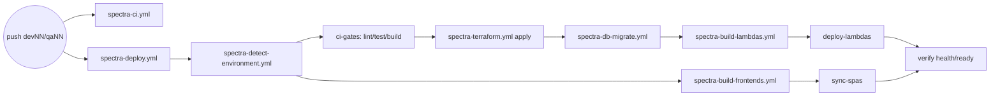

# Spectra CI/CD walkthrough

## Workflow inventory

| File | Purpose | Helper scripts |
| --- | --- | --- |
| [`spectra-ci.yml`](../../.github/workflows/spectra-ci.yml) | Lint/test/build on PRs (`nx affected`) and pushes (`run-many --all`). Required status check. | — |
| [`spectra-detect-environment.yml`](../../.github/workflows/spectra-detect-environment.yml) | Reusable: branch → stage label, hostnames, S3 buckets, TF state key. | — |
| [`spectra-build-lambdas.yml`](../../.github/workflows/spectra-build-lambdas.yml) | Reusable: Nx-build & zip every Node service per env, upload `backend-<env>-<service>` artifacts. | `scripts/ci/package-lambda.sh` |
| [`spectra-build-frontends.yml`](../../.github/workflows/spectra-build-frontends.yml) | Reusable: matrix-build the three Angular SPAs for the env (URLs embedded). | — |
| [`spectra-terraform.yml`](../../.github/workflows/spectra-terraform.yml) | Reusable: `fmt -check`, `validate`, `plan` (PR), `apply` (push/dispatch). Comments plan on PRs. | `scripts/ci/apply-terraform.sh` |
| [`spectra-db-migrate.yml`](../../.github/workflows/spectra-db-migrate.yml) | Reusable: `drizzle-kit migrate` against the env Neon branch. | `scripts/ci/run-migrations.sh` |
| [`spectra-deploy.yml`](../../.github/workflows/spectra-deploy.yml) | Orchestrator. Auto-runs on `dev*/qa*/hotfix*/staging*` pushes; manual for `prod`. `concurrency: spectra-deploy-${{ github.ref_name }}`. | `package-lambda.sh`, `sync-spa.sh`, `verify-deployment.sh` |
| [`spectra-cleanup-subenv.yml`](../../.github/workflows/spectra-cleanup-subenv.yml) | Manual destroy of `dev*/qa*/staging*/hotfix*`. | `scripts/ci/cleanup-subenv.sh` |
| [`spectra-rollback.yml`](../../.github/workflows/spectra-rollback.yml) | Manual flip of `live` Lambda alias to a prior S3 zip. | `scripts/ci/rollback-lambda.sh` |
| [`dependency-scan.yml`](../../.github/workflows/dependency-scan.yml) | Trivy fs scan; advisory on PRs, required on `main` / `staging*`. | — |
| `spectra-build-{seq,quantum,corridor,ml-camp}.yml` | Polyglot placeholders (`if: false`) for future runtimes. | — |

## Helper scripts (`scripts/ci/`)

- `lib/common.sh` — log helpers, retries, env-var validation.
- `lib/logging.sh` — optional structured (JSON) logger that falls back to plain text.
- `lib/aws-helpers.sh` — STS account ID cache, S3 / CloudFront / Lambda helpers.
- `lib/lambda-helpers.sh` — zip dist dirs, compute deterministic backend hash, Spectra naming helpers (`spectra-${main_env}-${env}-<service>`, `${main_env}-${env}-spectra-lambda-deployments`).
- `lib/terraform-helpers.sh` — `terraform init -backend-config=...` with retries, `plan`, `apply`, state checks.
- `pre-flight-validation.sh` — sanity-check creds and tools before any deploy.
- `package-lambda.sh` — Nx dist → zip + `<service>.hash`.
- `sync-spa.sh` — `aws s3 sync` an SPA artifact + optional CloudFront invalidate.
- `run-migrations.sh` — runs `npm run db:migrate`.
- `apply-terraform.sh` — entrypoint used by `spectra-terraform.yml`.
- `cleanup-subenv.sh` — `terraform destroy` for sandbox sub-envs.
- `rollback-lambda.sh` — `update-function-code` + `publish-version` + alias flip.
- `verify-deployment.sh` — curl `/v1/<segment>/health` and `/ready`, fail on non-200.

## Per-deploy ordering

Per the plan, **Terraform → secrets → migrate → Lambda code → SPAs**. The
orchestrator enforces this via `needs:` chains so a Lambda release never
runs before the schema is in place.

## Inputs (orchestrator)

- `target_branch` — override `github.ref_name`.
- `force_deploy` — bypass CI gate failures.
- `skip_tests` — skip lint/test/build (still requires Terraform plan to succeed).
- `force_invalidate` — full `/*` CloudFront invalidation even if the SPA didn't change.
- `run_seeding` — call into a future seed task after migrations (no-op today).

## Concurrency

- CI: `spectra-ci-${{ github.ref }}`, cancel-in-progress.
- Deploy: `spectra-deploy-${{ github.ref_name }}`, cancel-in-progress.
